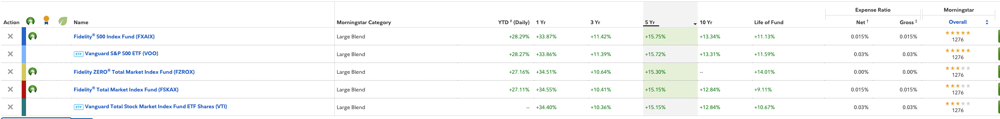

My investment research:
- [Only invest if:](#only-invest-if)
- [Brokerage accounts](#brokerage-accounts)
- [Types of funds:](#types-of-funds)
  - [Retirement:](#retirement)
  - [Investment:](#investment)
- [Types of Index funds:](#types-of-index-funds)
  - [Comparison Tool](#comparison-tool)
    - [Fidelity](#fidelity)
    - [Vanguard](#vanguard)
  - [Detailed Differences](#detailed-differences)
- [Things to Consider before selecting the fund](#things-to-consider-before-selecting-the-fund)
- [Terms to Know:](#terms-to-know)
- [References:](#references)

# Only invest if:
- You have no debts
- You have a 6-month emergency fund
- You've maxed out your 401k
- You've maxed out your IRA

# Brokerage accounts
1. Fidelity
2. Charles Schwab
3. Vanguard

# Types of funds:
## Retirement:
> Can be taken out past 59.5 years \
> 10% penalty for early withdrawal
1. 401k (pre-tax, saves on taxable income)
   - upto 23,000$ per year
   - upto a percentage of the base will be contributed by the companies
   - will not be considered as taxable income
2. Roth IRA (post-tax, saves on being taxed during withdrawal)
   - upto 6500$ per year
   - can be made only from income that is taxed (i.e no other source)
   - has to be within income i.e if income is < 2k, cant deposit more than 2k into roth
> Key Note: Both can be further invested into index funds

## Investment:
> Index Funds vs ETF's: 
- Index mutual funds can only be bought and sold at the end of the trading day, based on the fund's net asset value (NAV). 
- ETFs trade throughout the day on a stock exchange, just like stocks, and their price fluctuates based on supply and demand.
- ETF's are more tax efficient because they minimize capital gain whereas index funds are more prone to this tax (hasn't happened in past few years tho)

# Types of Index funds:
## [Comparison Tool](https://portfolioslab.com/tools/stock-comparison)
a. Track Market Trends:
   ### Fidelity
   1. [FXAIX](https://fundresearch.fidelity.com/mutual-funds/summary/315911750) = S&P500
   2. [FSKAX](https://fundresearch.fidelity.com/mutual-funds/summary/315911693) = Total US Market Capture (~3800 companies)
   3. [FTIHX](https://fundresearch.fidelity.com/mutual-funds/summary/31635V638) = International (outside US)
   4. FZROX = (recommended for Roth)
   5. FXNAX = Diversified between US Gov't and Corporate Bonds
   
   ### Vanguard
   1. [VOO](https://investor.vanguard.com/investment-products/etfs/profile/voo#overview) = S&P 500 (ETF)
   2. [VFIAX](https://investor.vanguard.com/investment-products/mutual-funds/profile/vfiax#overview) = S&P 500 (Fund)
   3. [VTI](https://investor.vanguard.com/investment-products/etfs/profile/vti) = Total US Market Capture (ETF)
   4. [VTSAX](https://investor.vanguard.com/investment-products/mutual-funds/profile/vtsax) = Total US Market Capture (Fund)
   5. VYM = Vanguard High Yield **Dividend** ETF

## Detailed Differences
| Comparison              | Fidelity | Vanguard | Charles Schwab | 
|-------------------------|----------|----------------|----------|
| Expense Ratio (S&P 500) |     0.015%  (FXAIX)   |     0.04% (VFIAX), 0.03% (VOO)            |  0.02% (SWPPX)       |
|                         |          |                |          |

# Things to Consider before selecting the fund
 1) Who runs the fund and how long have they been at the helm. What other funds do they run? 
 2) What is the fund's investment strategy? 
 3) What are the specific risks of this strategy besides the general risks of investing. 
 4) How has the fund been performing compared to some industry benchmark and other funds with a similar investing strategy.
 5) Percentage of diversification (recommended is 70% us market, 20% international, 10% bonds)

# Terms to Know:
1. Margin Interest Rates: 
   - we can borrow money against the principle being the stock that we own in the brokerage.
   - this is how the brokerages make money.

2. Expense Ratio:
   - percentage of the investment in the fund that is paid for owning the fund.
3. 

# References: 
1. [Fidelity vs Vanguard vs Charles Schwab](https://www.youtube.com/watch?v=rAewPVEjeLM) 

2. [Index Mutual Funds vs ETFs](https://www.investopedia.com/ask/answers/033015/whats-difference-between-index-fund-and-etf.asp#:~:text=Exchange-traded%20funds%20(ETFs)%20represent%20baskets%20of%20securities%20traded,efficient%20than%20similar%20mutual%20funds)

3. [Portfolio Management](https://www.bogleheads.org/wiki/Three-fund_portfolio)
4. [Average Annual Returns Comparison](https://fundresearch.fidelity.com/fund-screener/results/compare/overview/averageAnnualReturnsYear5/desc/1?order=tickers&tickers=FXAIX%2CVOO)